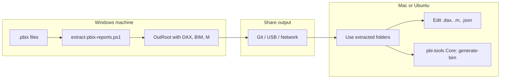

# Getting Started — Run on a New Machine

This guide lets any user run the same extraction workflow on a **new machine**, whether they use **Windows**, **macOS**, or **Ubuntu** (Linux).

---

## What’s in the package

| Item | Description |
|------|-------------|
| `scripts/extract-pbix-reports.ps1` | Main script: extracts one or more `.pbix` files to folders with DAX, M, and BIM. |
| `scripts/AddDevDirToPATH.ps1` | Optional: adds the local pbi-tools build to your PATH (Windows). |
| `README.md` | Overview, flow diagrams, and script usage. |
| `PowerBI Examples/` | Optional: sample `.pbix` files (you can replace with your own). |

**Output:** For each report, the script creates a folder under `OutRoot` with `windows-extract/legacy/` (DAX, JSON, M), `legacy.bim`, and `dax-index.txt`.

---

## Platform support

| Step | Windows | macOS | Ubuntu (Linux) |
|------|---------|--------|----------------|
| **Extract from .pbix** (full DAX/model) | ✅ Yes | ❌ No | ❌ No |
| **Generate BIM** from existing extracted folder | ✅ Yes | ✅ Yes (pbi-tools Core) | ✅ Yes (pbi-tools Core) |
| **Use / edit** extracted files (DAX, M, JSON) | ✅ Yes | ✅ Yes | ✅ Yes |

**Why:** Extracting the data model from a `.pbix` file requires **Power BI Desktop** and **pbi-tools Desktop**, which only run on **Windows**. On Mac and Linux you can still work with already-extracted content and run `generate-bim` using **pbi-tools Core**.



---

## Steps on a new machine

### 1. Get the package

**Option A — Clone (if you use Git):**

```bash
git clone <your-repo-url> pbi-tools-reports
cd pbi-tools-reports
```

**Option B — Download ZIP:**

- Download the repo as ZIP from GitHub (or your source).
- Unzip to a folder, e.g. `pbi-tools-reports`.
- Open a terminal in that folder.

Use the same folder path for the steps below (e.g. `C:\pbi-tools-reports` on Windows, `~/pbi-tools-reports` on Mac/Linux).

---

### 2. Windows — Full extraction (recommended for .pbix)

Use this when you have `.pbix` files and want to produce DAX/BIM/M output on this machine. You can run **natively** (PowerShell + PBI Desktop + pbi-tools) or **using Docker** (Windows containers); see requirements below.

#### 2.1 Windows requirements (native vs Docker)

| Requirement | Native (PowerShell) | Docker (Windows container) |
|-------------|---------------------|----------------------------|
| **OS** | Windows 64-bit | Windows 64-bit |
| **Power BI Desktop** (x64) | Install to default location | Install on host (default location); container uses it for extract. |
| **pbi-tools** | On PATH or build at `out\tools\pbi-tools-desktop\pbi-tools.exe` | Included in container image (no install on host). |
| **Docker Desktop** | Not required | Required; switch to **Windows containers**. |

See [2.4 Run using Docker on Windows](#24-run-using-docker-on-windows) for Docker steps.

#### 2.2 Prerequisites (for native run)

| Requirement | How to get it |
|-------------|----------------|
| **Power BI Desktop** (x64) | [Download](https://powerbi.microsoft.com/desktop/) — install to default location. |
| **pbi-tools** | **Option 1:** [Releases](https://github.com/pbi-tools/pbi-tools/releases) — download `pbi-tools-desktop-win-x64.zip`, unzip, add folder to PATH.<br>**Option 2:** Build from source (see repo README “Developer Notes”) — script will use `out\tools\pbi-tools-desktop\pbi-tools.exe` if `pbi-tools` is not on PATH. |

#### 2.3 Run the script (native PowerShell)

From the **package root** (where `scripts` and `PowerBI Examples` live), in **PowerShell**:

```powershell
# Default: source = "PowerBI Examples", output = "out"
.\scripts\extract-pbix-reports.ps1

# Your own folders (relative or absolute)
.\scripts\extract-pbix-reports.ps1 -SourcePath "C:\MyReports" -OutRoot "C:\Extracted" -Force
```

- **SourcePath:** Folder with `.pbix` files, or path to one `.pbix` file.
- **OutRoot:** Root folder for output; each report gets `OutRoot\<ReportName>\`.
- **-Force:** Overwrite existing output for each report.

After this, you get one folder per report under `OutRoot` with `windows-extract\legacy\`, `legacy.bim`, and `dax-index.txt`.

#### 2.4 Run using Docker on Windows

You can run the same extraction inside a **Windows container** so the host only needs Docker and Power BI Desktop (no need to install pbi-tools on the host). The repo is mounted into the container, so output appears in your local `out` folder.

**Steps:**

1. **Install and switch to Windows containers**
   - Install [Docker Desktop for Windows](https://docs.docker.com/desktop/install/windows-install/).
   - In Docker Desktop: tray icon → **Switch to Windows containers...** (required for full extract).
   - Confirm: run `docker info` and check that the runtime is Windows.

2. **Build the image** (from repo root):

   ```powershell
   cd path\to\pbi-tools-reports
   docker compose -f docker/compose.windows.yml build
   ```

3. **Test pbi-tools in the container:**

   ```powershell
   docker compose -f docker/compose.windows.yml run --rm pbi-tools-win info
   ```

4. **Extract one report** (paths are inside the container workspace, which is your repo root):

   ```powershell
   docker compose -f docker/compose.windows.yml run --rm pbi-tools-win extract "PowerBI Examples\Territory Tracker -Slim.pbix" -extractFolder "out\Territory Tracker -Slim\windows-extract\legacy" -modelSerialization Legacy
   docker compose -f docker/compose.windows.yml run --rm pbi-tools-win generate-bim "out\Territory Tracker -Slim\windows-extract\legacy"
   ```

5. **Extract all reports** (same as the script): run the **native PowerShell script** on the host (it uses pbi-tools from the container if you don’t have it installed). Or run extract + generate-bim in a loop for each `.pbix` in your source folder.

**Notes:**

- The container uses **pbi-tools** from the image; **Power BI Desktop** must be installed on the **host** in the default location (the container uses the host’s PBI for extract).
- Full details: see [docker/README.windows.md](docker/README.windows.md) in the repo.
- This does **not** run on macOS/Linux Docker (Windows containers only).

---

### 3. macOS — Use extracted output (no .pbix extract here)

You **cannot** run the full “extract from .pbix” step on Mac (Power BI Desktop is Windows-only). You can:

- **A)** Get extracted output from a Windows machine (or CI) and work with it on Mac.
- **B)** Optionally run **generate-bim** on an already-extracted folder using **pbi-tools Core**.

#### 3.1 Prerequisites

| Requirement | How to get it |
|-------------|----------------|
| **.NET 8 runtime** | [Download .NET 8](https://dotnet.microsoft.com/download/dotnet/8.0) for macOS. |
| **pbi-tools Core** | [Releases](https://github.com/pbi-tools/pbi-tools/releases) — use Linux/macOS build or build from source; put `pbi-tools` on PATH. |
| **PowerShell (optional)** | To run the same script syntax: `brew install powershell` → `pwsh`. Script’s *extract* step will still fail on Mac; use for generate-bim or for consistency. |

#### 3.2 Get extracted content

- Copy the `OutRoot` folder (e.g. `out`) from a Windows run, or from Git/network share.
- Or use a Windows CI job (e.g. GitHub Actions) to produce and publish the artifacts.

#### 3.3 (Optional) Generate BIM on Mac

If you have an extracted folder (e.g. `out/MyReport/windows-extract/legacy`) and want to regenerate the `.bim`:

```bash
pbi-tools generate-bim out/MyReport/windows-extract/legacy
# Output: out/MyReport/windows-extract/legacy.bim
```

#### 3.4 (Optional) Run using Docker on Mac

The **Linux Docker image** ([docker/Dockerfile](docker/Dockerfile)) runs on Mac (Intel and Apple Silicon). It uses **pbi-tools Core** — no `extract` from `.pbix`, but you can run `generate-bim` and other Core commands on already-extracted folders.

```bash
# Build once
docker compose -f docker/compose.yml build

# Generate BIM from an extracted folder
docker compose -f docker/compose.yml run --rm pbi-tools generate-bim out/MyReport/windows-extract/legacy
```

See [docker/README.md](docker/README.md) for full steps.

---

### 4. Ubuntu (Linux) — Same as macOS

Same limitations and options as macOS:

- **Extract from .pbix:** Not supported on Linux (Windows only).
- **Use extracted output:** Yes — copy from Windows or CI.
- **generate-bim:** Yes — install [.NET 8](https://dotnet.microsoft.com/download/dotnet/8.0) and [pbi-tools Core](https://github.com/pbi-tools/pbi-tools/releases) (Linux x64), then:

```bash
pbi-tools generate-bim out/MyReport/windows-extract/legacy
```

---

## One-page checklist (new machine)

| Step | Windows | macOS | Ubuntu |
|------|---------|--------|--------|
| 1. Get package | Clone or download ZIP → open folder in terminal | Same | Same |
| 2. Prerequisites | PBI Desktop + pbi-tools (Desktop or local build) | .NET 8 + pbi-tools Core (optional) | .NET 8 + pbi-tools Core (optional) |
| 3. Run extraction | `.\scripts\extract-pbix-reports.ps1 -SourcePath "PowerBI Examples" -OutRoot "out" -Force` | Use output from Windows/CI | Use output from Windows/CI |
| 4. Optional generate-bim on existing folder | Included in script | `pbi-tools generate-bim <legacy-folder>` | Same as macOS |

---

## Sharing so others can use it

1. **Share the repo** (Git clone or ZIP) so others get `scripts/`, `README.md`, and this file.
2. **Point them here:** “Follow **GETTING_STARTED.md** on your OS.”
3. **Windows users** with `.pbix` files can run the script as-is.
4. **Mac/Ubuntu users** use extracted output (from Windows or CI) and can run `pbi-tools generate-bim` on extracted folders if they install pbi-tools Core.

No extra “installer” is required; the package is the repo (or a copy of it) plus the prerequisites listed above.
