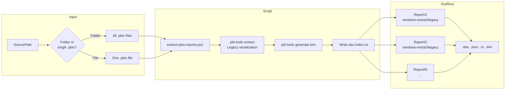
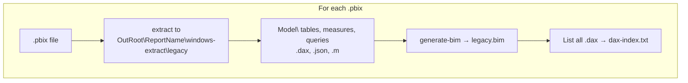

# pbi-tools


`pbi-tools` is a command-line tool bringing source-control features to Power BI. It works alongside Power BI Desktop and enables mature enterprise workflows for Power BI projects.

An example project is available here: <https://github.com/pbi-tools/adventureworksdw2020-pbix>

[](https://github.com/pbi-tools/pbi-tools/releases/latest)

## User Notes

- See <https://pbi.tools/cli/>

---

## Extract PBIX Reports (scripts)

The `scripts\extract-pbix-reports.ps1` script extracts one or more `.pbix` reports into a folder structure with **Legacy** model serialization (DAX measures, M queries, BIM). You define the **source** (folder or single file) and the **output** root; each report gets its own subfolder.

### Flow diagram



**Per-report flow:**



### Prerequisites

- **Power BI Desktop** (x64) installed in the default location (used by pbi-tools for extraction).
- **pbi-tools** either on PATH, or built locally at `out\tools\pbi-tools-desktop\pbi-tools.exe` (script will use the local build if the command is not found).

### Parameters

| Parameter     | Description | Default |
|--------------|-------------|--------|
| `SourcePath` | Folder containing `.pbix` files, or path to a single `.pbix` file. Relative paths are from the repo root. | `PowerBI Examples` |
| `OutRoot`    | Root folder for output. Each report gets `OutRoot\<ReportName>\`. Relative paths are from the repo root. | `out` |
| `Force`      | If set, overwrites existing output folders for each report. | — |

### Usage examples

From the repo root (e.g. `c:\...\pbi-tools`):

```powershell
# Default: all .pbix in "PowerBI Examples" → output under "out"
.\scripts\extract-pbix-reports.ps1

# Custom source folder and output folder
.\scripts\extract-pbix-reports.ps1 -SourcePath "D:\Reports" -OutRoot "D:\Extracted"

# Single report
.\scripts\extract-pbix-reports.ps1 -SourcePath "PowerBI Examples\Daily Sales Report_2025.pbix" -OutRoot "out\daily-sales"

# Overwrite existing output
.\scripts\extract-pbix-reports.ps1 -SourcePath "PowerBI Examples" -OutRoot "out" -Force
```

Absolute paths are also supported:

```powershell
.\scripts\extract-pbix-reports.ps1 -SourcePath "C:\PowerBI\Reports" -OutRoot "C:\PowerBI\Extracted"
```

### Output structure (per report)

For each report, the script creates:

```
OutRoot\
  <ReportName>\
    dax-index.txt              # List of all .dax file paths
    windows-extract\
      legacy\                  # Extracted model (tables, measures, queries)
        Model\
          tables\...\*.dax, *.json
          queries\*.m
        Connections.json
        Report\...
      legacy.bim               # Generated BIM file
```

### Optional: Add dev tools to PATH

To use the locally built `pbi-tools` from any directory, you can add the build output to your session PATH:

```powershell
.\scripts\AddDevDirToPATH.ps1
```

---

## Developer Notes

### Build System

- All build targets are implemented using [FAKE](https://fake.build/).
- Dependencies are managed using [Paket](https://fsprojects.github.io/Paket/).
- Main entry point for all build tasks is `.\build.cmd`.
- The [fake-cli](https://fake.build/fake-commandline.html) tool is installed as a [local .NET Core Tool](https://docs.microsoft.com/en-us/dotnet/core/tools/global-tools#install-a-local-tool), see [.config\dotnet-tools.json](./.config/dotnet-tools.json). The `build.cmd` script handles the tool installation.

### Prerequisites

- Visual Studio 2022 17.2 or later (for MSBuild dependencies), incl C# 11
- .Net 4.7.2 Targeting Pack
- .Net 9.0 SDK
- Power BI Desktop x64 (Must be installed in default location for local development: `C:\Program Files\Microsoft Power BI Desktop\`)

### List Build Targets

    dotnet fake build --list

Simply running the build script without any arguments will also list the available targets.

On Windows:

    ./build.cmd

On Linux:

    ./build.sh

### Versioning

The project strictly adheres to [SemVer v2](https://semver.org/) for release versioning. The build system uses the first entry in [RELEASE_NOTES.md](./RELEASE_NOTES.md) to inject version numbers into build artifacts.

### Diagnostics

- Log output can be controlled using the environment variable `PBITOOLS_LogLevel`.
- Allowed values are:
  - Verbose
  - Debug
  - Information
  - Warning
  - Error
  - Fatal
- The default is ***Information***, which is also effective when an unknown/invalid option has been specified.

### Build

    .\build.cmd Build

### Run Tests

    .\build.cmd Test

### Run All Targets (Build, Publish, Test, UsageDocs, Pack)

    .\build.cmd Pack

### Run only the specified build target

    .\build.cmd UsageDocs -s
    dotnet fake build -s -t SmokeTest

### Install Dependencies

    dotnet paket install

_That is generally not needed as the `build.cmd` script takes care of fetching dependencies. However, it could be useful to run this manually on a fresh clone or after making changes in the `paket.dependencies` file._

### Update Specific Dependency to latest version (ex: AMO)

    dotnet paket update Microsoft.AnalysisServices
    dotnet paket update Microsoft.AnalysisServices.AdomdClient

### Updating All Dependencies (NuGet)

    dotnet paket update
    dotnet paket update -g Fake-Build

### Find outdated dependencies

    dotnet paket outdated -g Main

### Invoke Build script directly

    dotnet fake {...}
    dotnet fake -t Build
    dotnet fake --version

### Extract embedded sample PBIX with local build version and using default settings

    .\pbi-tools.local.cmd extract '.\data\Samples\Adventure Works DW 2020.pbix'

### Extract embedded sample PBIX with local build version and 'Raw' serialization mode, into custom output folder

    .\pbi-tools.local.cmd extract '.\data\Samples\Adventure Works DW 2020.pbix' -extractFolder '.\data\Samples\Adventure Works DW 2020 - Raw' -modelSerialization Raw

### Enable Debug logging (PowerShell)

    $env:PBITOOLS_LogLevel = "Debug"

### Fast local build (no clean)

    .\build.cmd Publish -s
    .\build.cmd Pack -s

### Invoke CI Build target locally

    $env:PBITOOLS_IsLocalBuild = "false"
    .\build.cmd CI-Build

## Git Submodules

### Clone with submodules

    git clone --recurse-submodules https://github.com/pbi-tools/pbi-tools.git

### Init & Update

    git submodule update --init

### Pulling in Upstream Changes

    git submodule update --remote

### Clone specific single branch into named folder, with submodules

    git clone -b Release/1.0.0-beta.9 --single-branch --recurse-submodules https://github.com/pbi-tools/pbi-tools.git ./1.0.0-beta.9
