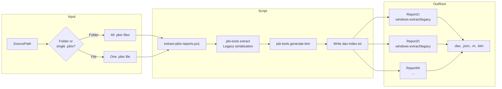
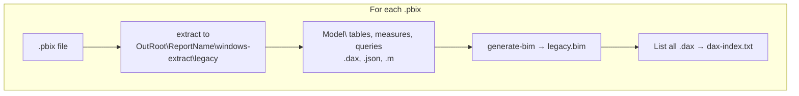

# pbi-tools


`pbi-tools` is a command-line tool bringing source-control features to Power BI. It works alongside Power BI Desktop and enables mature enterprise workflows for Power BI projects.

An example project is available here: <https://github.com/pbi-tools/adventureworksdw2020-pbix>

[](https://github.com/pbi-tools/pbi-tools/releases/latest)

## User Notes

- See <https://pbi.tools/cli/>

---

## Prerequisites (required before installation)

Ensure you have the following **before** setting up or running the extraction workflow:

| Prerequisite | Requirement |
|--------------|-------------|
| **Operating system** | **Windows** (x64) — extracting from `.pbix` files is supported only on Windows. On macOS/Linux you can use already-extracted output and `generate-bim` only. |
| **PowerShell** | Windows PowerShell 5.1 or PowerShell Core (e.g. PowerShell 7+) — used to run `extract-pbix-reports.ps1`. |
| **Power BI Desktop** | [Power BI Desktop](https://powerbi.microsoft.com/desktop/) (x64), installed in the **default location** (`C:\Program Files\Microsoft Power BI Desktop\`). Required for pbi-tools to extract from `.pbix`. |
| **pbi-tools** | Either **(A)** [pbi-tools](https://github.com/pbi-tools/pbi-tools/releases) on your system PATH, or **(B)** the executable placed at `out\tools\pbi-tools-desktop\pbi-tools.exe` inside this project. The script will use the local exe if present. |
| **Git** (optional) | Only if you clone the repo with Git. You can instead download the project as a ZIP. |

**Summary:** You need Windows, PowerShell, Power BI Desktop in the default location, and pbi-tools (on PATH or in the project folder). Then you can run the extraction script.

---

## First-time setup (new users)

Follow these steps **once** to get extraction working on your machine.

### 1. Get the project

- **Clone the repo** (with submodules if applicable):
  ```powershell
  git clone --recurse-submodules <repo-url> powerbi-extraction
  cd powerbi-extraction
  ```
- Or **download and extract** the project ZIP, then open a terminal in the project folder.

### 2. Install prerequisites (Windows)

If anything from [Prerequisites (required before installation)](#prerequisites-required-before-installation) is missing, install it now:

| Requirement | What to do |
|-------------|------------|
| **Power BI Desktop** | Install [Power BI Desktop](https://powerbi.microsoft.com/desktop/) (x64) in the default location. The extraction script uses it via pbi-tools. |
| **pbi-tools** | Either: **(A)** Add [pbi-tools](https://github.com/pbi-tools/pbi-tools/releases) to your PATH, or **(B)** Place `pbi-tools.exe` in the project at: `out\tools\pbi-tools-desktop\pbi-tools.exe` (create those folders if needed). The script will use the local exe if present. |

To use the **local build** instead of a downloaded exe, see [Developer Notes](#developer-notes) (requires .NET SDK and build).

### 3. Add your PBIX files

- In the **project root** (same folder as `scripts`), create a folder named **`PowerBI Examples`** (if it doesn’t exist).
- Copy your `.pbix` report files into **`PowerBI Examples`**.
- The script will process every `.pbix` in that folder (or you can point it to another folder or a single file; see [Parameters](#parameters)).

### 4. Run extraction

From the **project root** (the folder that contains the `scripts` folder) in PowerShell:

```powershell
# Extract all reports from "PowerBI Examples" into the default "out" folder
.\scripts\extract-pbix-reports.ps1
```

- Output appears under **`out\<ReportName>\`** (DAX, M, BIM, etc.).
- To process reports one at a time with a pause between each: add **`-OneByOne`**.
- To overwrite existing output: add **`-Force`**.

Example (one-by-one, overwrite):

```powershell
.\scripts\extract-pbix-reports.ps1 -SourcePath "PowerBI Examples" -OutRoot "out" -OneByOne -Force
```

### 5. Optional: run with Docker

On Windows you can run extraction in a container instead of installing pbi-tools locally. See [docker/README.windows.md](docker/README.windows.md).

---

## Packaging & running on a new machine (Windows, Mac, Ubuntu)

To let other users run the same workflow on a **new machine** (Windows, macOS, or Ubuntu):

1. **Package = this repo** — Share by cloning or downloading the repo (ZIP). No separate installer.
2. **First-time users** — Use the [First-time setup](#first-time-setup-new-users) section above for step-by-step setup on Windows.
3. **More detail** — If present, **[GETTING_STARTED.md](./GETTING_STARTED.md)** has the full platform matrix (extract from `.pbix` = Windows only; use extracted output / `generate-bim` = any OS), macOS/Ubuntu steps, and a one-page checklist.

| Platform | Extract from .pbix | Use extracted output / generate-bim |
|----------|--------------------|--------------------------------------|
| **Windows** | ✅ Yes (PBI Desktop + pbi-tools) | ✅ Yes |
| **macOS**   | ❌ No              | ✅ Yes (pbi-tools Core) |
| **Ubuntu**  | ❌ No              | ✅ Yes (pbi-tools Core) |

---

## Extract PBIX Reports (scripts)

The `scripts\extract-pbix-reports.ps1` script extracts one or more `.pbix` reports into a folder structure with **Legacy** model serialization (DAX measures, M queries, BIM). You define the **source** (folder or single file) and the **output** root; each report gets its own subfolder.

### Flow diagram


```mermaid
flowchart LR
    subgraph Input
        A[SourcePath]
        A --> B{Folder or<br/>single .pbix?}
        B -->|Folder| C[All .pbix files]
        B -->|File| D[One .pbix file]
    end

    subgraph Script
        C --> E[extract-pbix-reports.ps1]
        D --> E
        E --> F[pbi-tools extract<br/>Legacy serialization]
        F --> G[pbi-tools generate-bim]
        G --> H[Write dax-index.txt]
    end

    subgraph Output["OutRoot"]
        H --> I[Report1\<br/>windows-extract\legacy]
        H --> J[Report2\<br/>windows-extract\legacy]
        H --> K[ReportN\<br/>...]
        I --> L[.dax, .json, .m, .bim]
        J --> L
        K --> L
    end
```

**Per-report flow:**


```mermaid
flowchart TD
    subgraph PerReport["For each .pbix"]
        P1[.pbix file] --> P2[extract to<br/>OutRoot\ReportName\windows-extract\legacy]
        P2 --> P3[Model\ tables, measures, queries<br/>.dax, .json, .m]
        P3 --> P4[generate-bim → legacy.bim]
        P4 --> P5[List all .dax → dax-index.txt]
    end
```

### Prerequisites (Windows)

- **Power BI Desktop** (x64) installed in the default location (used by pbi-tools for extraction).
- **pbi-tools** either on PATH, or built locally at `out\tools\pbi-tools-desktop\pbi-tools.exe` (script will use the local build if the command is not found).

You can also run extraction **using Docker** (Windows containers): see [GETTING_STARTED.md — Run using Docker on Windows](GETTING_STARTED.md#24-run-using-docker-on-windows) and [docker/README.windows.md](docker/README.windows.md).

### Parameters

| Parameter     | Description | Default |
|--------------|-------------|--------|
| `SourcePath` | Folder containing `.pbix` files, or path to a single `.pbix` file. Relative paths are from the repo root. | `PowerBI Examples` |
| `OutRoot`    | Root folder for output. Each report gets `OutRoot\<ReportName>\`. Relative paths are from the repo root. | `out` |
| `Force`      | If set, overwrites existing output folders for each report. | — |
| `OneByOne`   | If set, pauses after each report and waits for a key press before processing the next. | — |

### Usage examples

From the repo root (e.g. `c:\...\pbi-tools`):

```powershell
# Default: all .pbix in "PowerBI Examples" → output under "out"
.\scripts\extract-pbix-reports.ps1

# Custom source folder and output folder
.\scripts\extract-pbix-reports.ps1 -SourcePath "D:\Reports" -OutRoot "D:\Extracted"

# Single report
.\scripts\extract-pbix-reports.ps1 -SourcePath "PowerBI Examples\Daily Sales Report_2025.pbix" -OutRoot "out\daily-sales"

# Overwrite existing output
.\scripts\extract-pbix-reports.ps1 -SourcePath "PowerBI Examples" -OutRoot "out" -Force

# Process reports one by one (pause after each; press any key to continue)
.\scripts\extract-pbix-reports.ps1 -SourcePath "PowerBI Examples" -OutRoot "out" -OneByOne
```

Absolute paths are also supported:

```powershell
.\scripts\extract-pbix-reports.ps1 -SourcePath "C:\PowerBI\Reports" -OutRoot "C:\PowerBI\Extracted"
```

### Output structure (per report)

For each report, the script creates:

```
OutRoot\
  <ReportName>\
    dax-index.txt              # List of all .dax file paths
    windows-extract\
      legacy\                  # Extracted model (tables, measures, queries)
        Model\
          tables\...\*.dax, *.json
          queries\*.m
        Connections.json
        Report\...
      legacy.bim               # Generated BIM file
```

### Optional: Add dev tools to PATH

To use the locally built `pbi-tools` from any directory, you can add the build output to your session PATH:

```powershell
.\scripts\AddDevDirToPATH.ps1
```

---

## Developer Notes

### Build System

- All build targets are implemented using [FAKE](https://fake.build/).
- Dependencies are managed using [Paket](https://fsprojects.github.io/Paket/).
- Build tasks are run via FAKE: `dotnet tool restore` then `dotnet run --project ./build/build.fsproj -- -t <target>`.
- The [fake-cli](https://fake.build/fake-commandline.html) tool is installed as a [local .NET Core Tool](https://docs.microsoft.com/en-us/dotnet/core/tools/global-tools#install-a-local-tool), see [.config\dotnet-tools.json](./.config/dotnet-tools.json). Run `dotnet tool restore` once to install it.

### Prerequisites

- Visual Studio 2022 17.2 or later (for MSBuild dependencies), incl C# 11
- .Net 4.7.2 Targeting Pack
- .Net 9.0 SDK
- Power BI Desktop x64 (Must be installed in default location for local development: `C:\Program Files\Microsoft Power BI Desktop\`)

### List Build Targets

    dotnet fake build --list

To list available targets:

    dotnet tool restore
    dotnet run --project ./build/build.fsproj -- --list

### Versioning

The project strictly adheres to [SemVer v2](https://semver.org/) for release versioning. The build system uses the first entry in [RELEASE_NOTES.md](./RELEASE_NOTES.md) to inject version numbers into build artifacts.

### Diagnostics

- Log output can be controlled using the environment variable `PBITOOLS_LogLevel`.
- Allowed values are:
  - Verbose
  - Debug
  - Information
  - Warning
  - Error
  - Fatal
- The default is ***Information***, which is also effective when an unknown/invalid option has been specified.

### Build

    dotnet run --project ./build/build.fsproj -- -t Build

### Run Tests

    dotnet run --project ./build/build.fsproj -- -t Test

### Run All Targets (Build, Publish, Test, UsageDocs, Pack)

    dotnet run --project ./build/build.fsproj -- -t Pack

### Run only the specified build target

    dotnet run --project ./build/build.fsproj -- -t UsageDocs -s
    dotnet fake build -s -t SmokeTest

### Install Dependencies

    dotnet paket install

_That is generally not needed as the build invokes tool restore. However, it could be useful to run this manually on a fresh clone or after making changes in the `paket.dependencies` file._

### Update Specific Dependency to latest version (ex: AMO)

    dotnet paket update Microsoft.AnalysisServices
    dotnet paket update Microsoft.AnalysisServices.AdomdClient

### Updating All Dependencies (NuGet)

    dotnet paket update
    dotnet paket update -g Fake-Build

### Find outdated dependencies

    dotnet paket outdated -g Main

### Invoke Build script directly

    dotnet fake {...}
    dotnet fake -t Build
    dotnet fake --version

### Extract embedded sample PBIX with local build version and using default settings

    .\pbi-tools.local.cmd extract '.\data\Samples\Adventure Works DW 2020.pbix'

### Extract embedded sample PBIX with local build version and 'Raw' serialization mode, into custom output folder

    .\pbi-tools.local.cmd extract '.\data\Samples\Adventure Works DW 2020.pbix' -extractFolder '.\data\Samples\Adventure Works DW 2020 - Raw' -modelSerialization Raw

### Enable Debug logging (PowerShell)

    $env:PBITOOLS_LogLevel = "Debug"

### Fast local build (no clean)

    dotnet run --project ./build/build.fsproj -- -t Publish -s
    dotnet run --project ./build/build.fsproj -- -t Pack -s

### Invoke CI Build target locally

    $env:PBITOOLS_IsLocalBuild = "false"
    dotnet run --project ./build/build.fsproj -- -t CI-Build

## Git Submodules

### Clone with submodules

    git clone --recurse-submodules https://github.com/pbi-tools/pbi-tools.git

### Init & Update

    git submodule update --init

### Pulling in Upstream Changes

    git submodule update --remote

### Clone specific single branch into named folder, with submodules

    git clone -b Release/1.0.0-beta.9 --single-branch --recurse-submodules https://github.com/pbi-tools/pbi-tools.git ./1.0.0-beta.9
